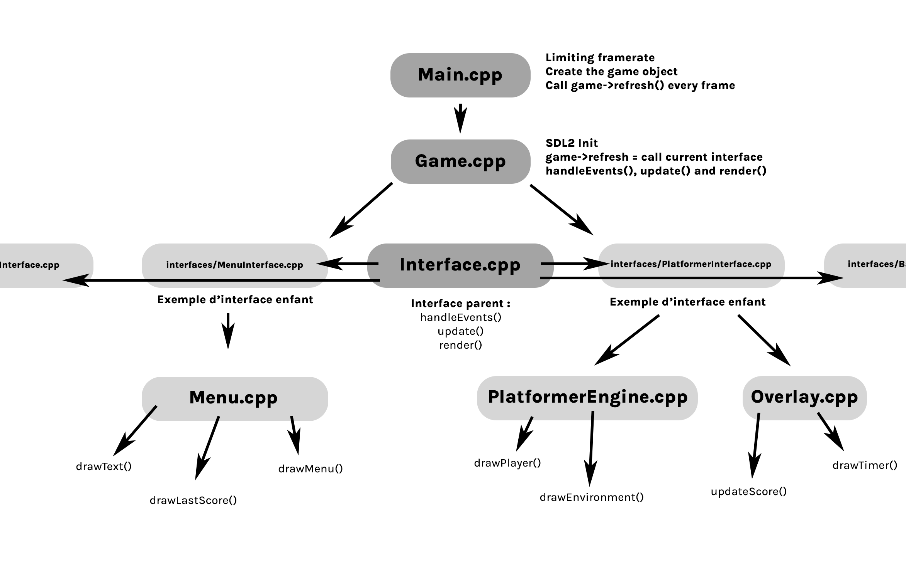

# SDL2_Boilerplate with interfaces system

[OPENGL COMPATIBILITY](https://github.com/MatteoL-W/SDL2_Boilerplate/tree/OPENGL_COMPAT) -> branch OPENGL_COMPAT

[MAKEFILE VERSION](https://github.com/MatteoL-W/SDL2_Boilerplate/tree/WITH_MAKEFILE_ONLY) -> branch WITH_MAKEFILE_ONLY

### by [Mattéo Leclercq](https://github.com/MatteoL-W/)

Thanks to [Enguerrand](https://github.com/dsmtE) for the CMake help 😄

The CMake should be working with **MinGW builder** and **Linux** !

# Don't forget to remove this and write your own README.md 😄
